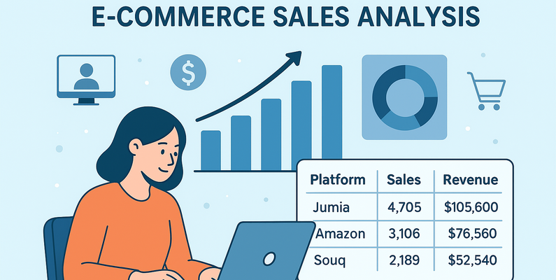

# 🛍 Análise Exploratória de Dados de E-commerce

Descubra como o comportamento de compra, a sazonalidade e o desempenho regional afetam a receita de uma operação de e-commerce.

## 🎯 Objetivo
O objetivo central deste estudo é fornecer uma análise desempenho de vendas da operação de e-commerce.

A análise foi executada para identificar padrões de consumo e ineficiências operacionais que podem ser corrigidas com base em dados. O foco foi em responder a perguntas essenciais do negócio, como:

- Foco da Receita: Quais canais e produtos são os principais geradores de faturamento e volume?

- Alocação de Recursos: Como a sazonalidade e o comportamento semanal das vendas devem guiar o planejamento de estoque e a concentração de campanhas de marketing?

- Estratégias de Canal: O que pode ser aprendido com o canal de maior desempenho (seja em volume ou valor médio) para otimizar os demais?

## ⚙ Metodologia e Etapas
O projeto foi conduzido como uma Análise Exploratória de Dados (EDA) estruturada, utilizando Python:

- Preparação de Dados: Verificação de valores nulos e duplicados, além da correta conversão da coluna temporal (OrderDate).

- Geração de Variáveis: Criação de colunas de tempo (Ano, Mês, Dia da Semana) para análise de sazonalidade.

- Métricas de Negócio: Cálculo de indicadores financeiros essenciais, como Faturamento Total e Ticket Médio por pedido.

- Análise de Desempenho: Segmentação dos dados por Produto, Plataforma e Região para identificar líderes e gaps de mercado.

- Conclusão e Aplicação: Tradução dos padrões identificados em um conjunto de recomendações diretas para as áreas de Marketing e Logística.

## 🔑 Resultados e Ações Estratégicas
- A análise identificou que a priorização de estoque deve focar em produtos de maior faturamento, e não apenas volume. 
- Estrategicamente, os investimentos em marketing devem ser concentrados nos dias de pico de demanda semanal.
- Observou-se uma distinção clara entre os canais de venda (algumas plataformas lideram em receita total e outras em ticket médio) e as diferentes regiões geográficas, permitindo a adoção de estratégias distintas de alto volume ou foco em vendas premium.

## 💻 Tecnologias Utilizadas
Python

Pandas (Tratamento e manipulação de dados)

Matplotlib e Seaborn (Visualização de dados)

## 💾 Fonte de Dados
Nome: E-commerce Data

Disponibilidade: Kaggle

Link: https://www.kaggle.com/datasets/jockeroika/ecommerce-data

## ▶ Como Executar o Projeto
Para visualizar a análise em seu ambiente local, siga as etapas:

1) Clone o Repositório:
   git clone https://github.com/laridesouza/analise-eccomerce.git
   cd analise-ecommerce

2) Instale as Dependências:
   pip install -r requirements.txt

3) Abra e Execute:
   jupyter notebook
